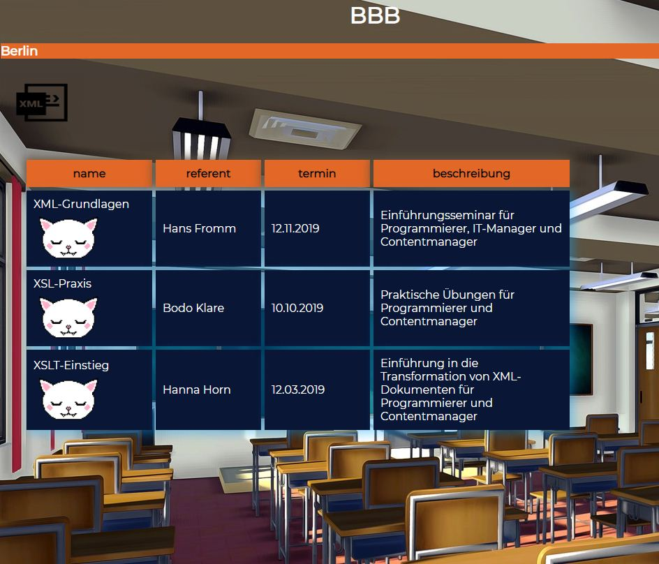

# XML-working-content-2

xampp is needed to run it [xampp](https://www.apachefriends.org/download.html). Save this xmlExample2 folder inside  the path: xampp/php/htdocs, then in browser paste http://localhost/php/xmlExample2/kursliste.xml

it should look like this:

